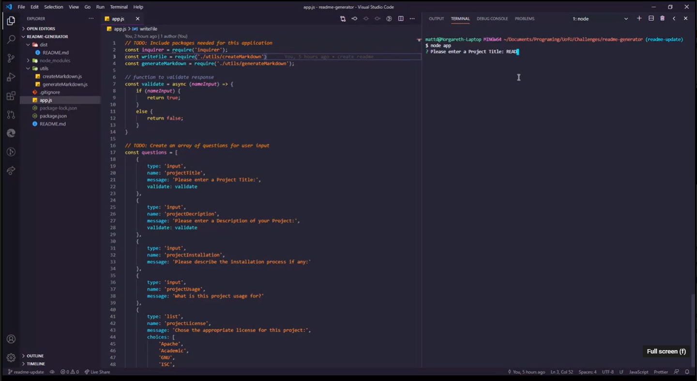

<h1 align="center">
README.md Generator

</h1>

## Table of Contents
- [Description](#description)
- [User Story](#user-story)
- [Acceptance Criteria](#Acceptance-criteria)
- [Screencast](#screencast)
- [Installation](#installation)
- [Usage](#usage)
- [License](#license)
- [Language](#language)
- [Contributors](#contributors)
- [Questions](#questions)

## Description
A node.js application that takes user input from inquirer to populate a README.md file for your user repository.<br />
When you complete the application it will create the README.md file in the dist directory.

## User Story
```
AS A developer
I WANT a README generator
SO THAT I can quickly create a professional README for a new project
```

## Acceptance Criteria
```
GIVEN a command-line application that accepts user input
WHEN I am prompted for information about my application repository
THEN a high-quality, professional README.md is generated with the title of my project and sections entitled Description, Table of Contents, Installation, Usage, License, Contributing, Tests, and Questions
WHEN I enter my project title
THEN this is displayed as the title of the README
WHEN I enter a description, installation instructions, usage information, contribution guidelines, and test instructions
THEN this information is added to the sections of the README entitled Description, Installation, Usage, Contributing, and Tests
WHEN I choose a license for my application from a list of options
THEN a badge for that license is added near the top of the README and a notice is added to the section of the README entitled License that explains which license the application is covered under
WHEN I enter my GitHub username
THEN this is added to the section of the README entitled Questions, with a link to my GitHub profile
WHEN I enter my email address
THEN this is added to the section of the README entitled Questions, with instructions on how to reach me with additional questions
WHEN I click on the links in the Table of Contents
THEN I am taken to the corresponding section of the README
```

## Screencast
[](https://drive.google.com/file/d/1fhJ8WjSsmwnVfBhrqTkjKFW5GMdggjMu/view?usp=sharing)

## Installation
[node.js](https://nodejs.org)<br />
`npm install`

## Usage
After you install Node.js on your computer browse to the application location in your terminal.<br />
Run the command 'node app' and folow the propmts to complete the README.md file.

## License
<br />
This application is covered by the MIT license. 

## Language


## Contributors
Matt

## Questions
Find me on GitHub: [matthewdamron](https://github.com/matthewdamron)<br />
Email me with any questions: mattdamron@msn.com<br />
_This README was generated with by a [readme-generator](https://github.com/matthewdamron/readme-generator)_
